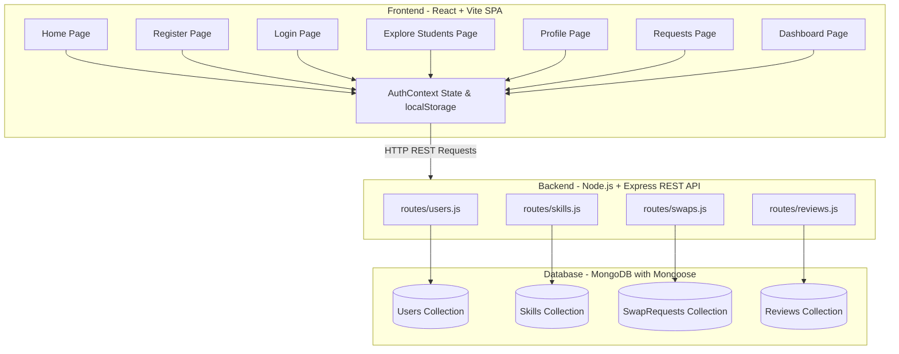

# 🏛️ System Architecture — SkillBridge

```mermaid
flowchart TD
    subgraph ClientLayer[Frontend - React + Vite SPA]
        P1[Home Page]
        P2[Register Page]
        P3[Login Page]
        P4[Explore Students Page]
        P5[Profile Page]
        P6[Requests Page]
        P7[Dashboard Page]
        AuthCtx[AuthContext State & localStorage]
    end

    subgraph APILayer[Backend - Node.js + Express REST API]
        R1[routes/users.js]
        R2[routes/skills.js]
        R3[routes/swaps.js]
        R4[routes/reviews.js]
    end

    subgraph DatabaseLayer[Database - MongoDB with Mongoose]
        D1[(Users Collection)]
        D2[(Skills Collection)]
        D3[(SwapRequests Collection)]
        D4[(Reviews Collection)]
    end

    P1 & P2 & P3 & P4 & P5 & P6 & P7 --> AuthCtx
    AuthCtx -->|HTTP REST Requests| APILayer

    R1 --> D1
    R2 --> D2
    R3 --> D3
    R4 --> D4
```
