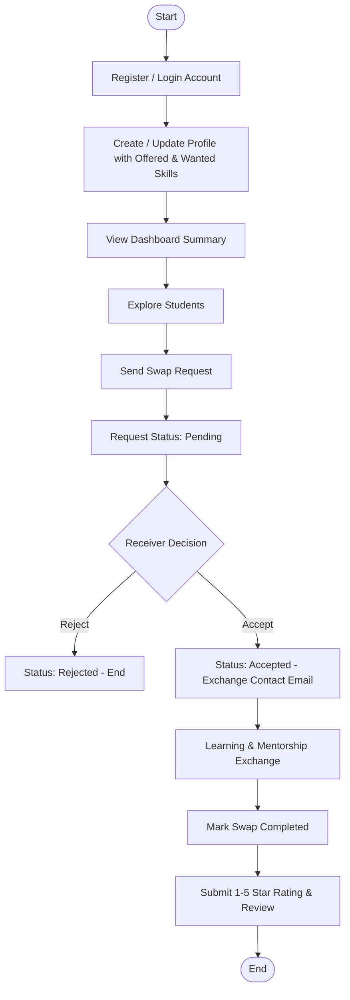

# 📊 Activity Diagram — SkillBridge Core Flow

```mermaid
flowchart TD
    Start([Start]) --> Register[Register / Login Account]
    Register --> Profile[Create / Update Profile with Offered & Wanted Skills]
    Profile --> Dashboard[View Dashboard Summary]
    Dashboard --> Explore[Explore Students]

    Explore --> SendSwap[Send Swap Request]

    SendSwap --> Pending[Request Status: Pending]

    Pending --> ReceiverDecision{Receiver Decision}

    ReceiverDecision -- Reject --> Rejected[Status: Rejected - End]
    ReceiverDecision -- Accept --> Accepted[Status: Accepted - Exchange Contact Email]

    Accepted --> LearningExchange[Learning & Mentorship Exchange]
    LearningExchange --> MarkCompleted[Mark Swap Completed]
    MarkCompleted --> LeaveReview[Submit 1-5 Star Rating & Review]
    LeaveReview --> End([End])
```
