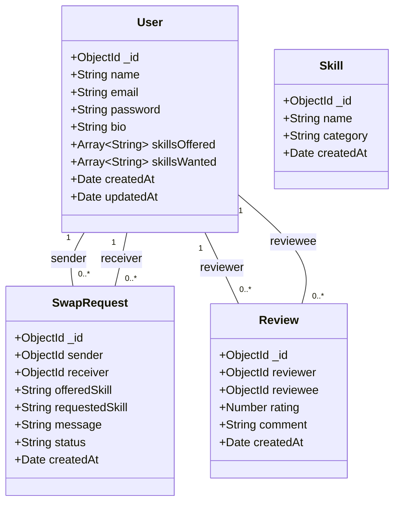

# 📊 Class Diagram — SkillBridge Data Models

```mermaid
classDiagram
    class User {
        +ObjectId _id
        +String name
        +String email
        +String password
        +String bio
        +Array~String~ skillsOffered
        +Array~String~ skillsWanted
        +Date createdAt
        +Date updatedAt
    }

    class Skill {
        +ObjectId _id
        +String name
        +String category
        +Date createdAt
    }

    class SwapRequest {
        +ObjectId _id
        +ObjectId sender
        +ObjectId receiver
        +String offeredSkill
        +String requestedSkill
        +String message
        +String status
        +Date createdAt
    }

    class Review {
        +ObjectId _id
        +ObjectId reviewer
        +ObjectId reviewee
        +Number rating
        +String comment
        +Date createdAt
    }

    User "1" -- "0..*" SwapRequest : sender
    User "1" -- "0..*" SwapRequest : receiver
    User "1" -- "0..*" Review : reviewer
    User "1" -- "0..*" Review : reviewee
```
