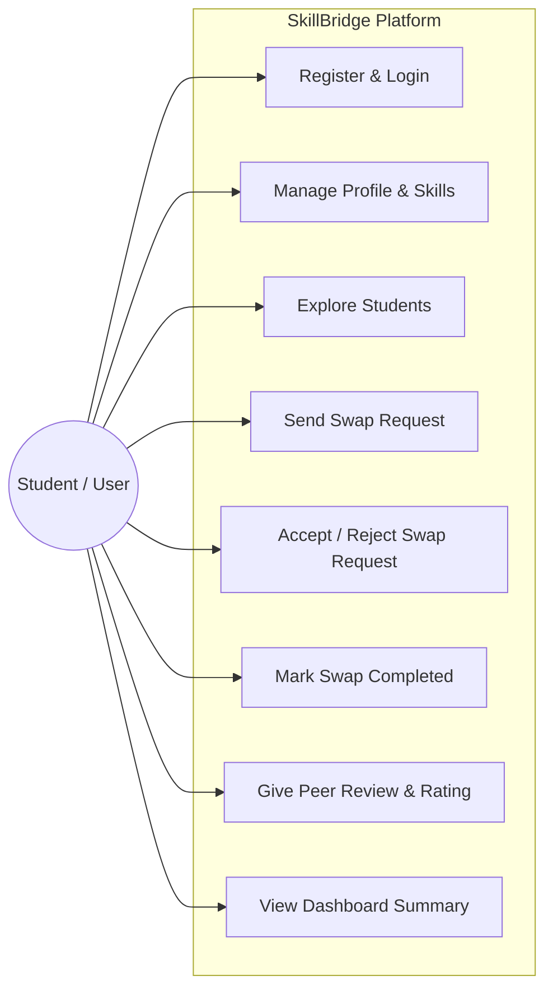

# 📊 Use Case Diagram — SkillBridge

```mermaid
flowchart LR
    Student((Student / User))

    subgraph SkillBridge Platform
        UC1[Register & Login]
        UC2[Manage Profile & Skills]
        UC3[Explore Students]
        UC4[Send Swap Request]
        UC5[Accept / Reject Swap Request]
        UC6[Mark Swap Completed]
        UC7[Give Peer Review & Rating]
        UC8[View Dashboard Summary]
    end

    Student --> UC1
    Student --> UC2
    Student --> UC3
    Student --> UC4
    Student --> UC5
    Student --> UC6
    Student --> UC7
    Student --> UC8
```
